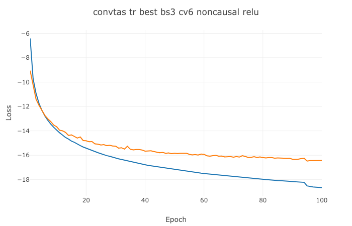

# Conv-TasNet
A PyTorch implementation of Conv-TasNet described in ["TasNet: Surpassing Ideal Time-Frequency Masking for Speech Separation"](https://arxiv.org/abs/1809.07454).

## Results
| From | N | L | B | H | P | X | R | Norm | Causal | batch size |SI-SNRi(dB) | SDRi(dB)|
|:----:|:-:|:-:|:-:|:-:|:-:|:-:|:-:|:----:|:------:|:----------:|:----------:|:-------:|
| Paper|256|20 |256|512| 3 | 8 | 4 |  gLN |   X    |     -      |    14.6    |  15.0   |
| Here |256|20 |256|512| 3 | 8 | 4 |  gLN |   X    |     3      |    15.5    |  15.7   |

## Install
- PyTorch 0.4.1+
- Python3 (Recommend Anaconda)
- `pip install -r requirements.txt`
- If you need to convert wjs0 to wav format and generate mixture files, `cd tools; make`

## Usage
If you already have mixture wsj0 data:
1. `$ cd egs/wsj0`, modify wsj0 data path `data` to your path in the beginning of `run.sh`.
2. `$ bash run.sh`, that's all!

If you just have origin wsj0 data (sphere format):
1. `$ cd egs/wsj0`, modify three wsj0 data path to your path in the beginning of `run.sh`.
2. Convert sphere format wsj0 to wav format and generate mixture. `Stage 0` part provides an example.
3. `$ bash run.sh`, that's all!

You can change hyper-parameter by `$ bash run.sh --parameter_name parameter_value`, egs, `$ bash run.sh --stage 3`. See parameter name in `egs/aishell/run.sh` before `. utils/parse_options.sh`.
### Workflow
Workflow of `egs/wsj0/run.sh`:
- Stage 0: Convert sphere format to wav format and generate mixture (optional)
- Stage 1: Generating json files including wav path and duration
- Stage 2: Training
- Stage 3: Evaluate separation performance
- Stage 4: Separate speech using Conv-TasNet
### More detail
```bash
# Set PATH and PYTHONPATH
$ cd egs/wsj0/; . ./path.sh
# Train:
$ train.py -h
# Evaluate performance:
$ evaluate.py -h
# Separate mixture audio:
$ separate.py -h
```
#### How to visualize loss?
If you want to visualize your loss, you can use [visdom](https://github.com/facebookresearch/visdom) to do that:
1. Open a new terminal in your remote server (recommend tmux) and run `$ visdom`
2. Open a new terminal and run `$ bash run.sh --visdom 1 --visdom_id "<any-string>"` or `$ train.py ... --visdom 1 --vidsdom_id "<any-string>"`
3. Open your browser and type `<your-remote-server-ip>:8097`, egs, `127.0.0.1:8097`
4. In visdom website, chose `<any-string>` in `Environment` to see your loss

#### How to resume training?
```bash
$ bash run.sh --continue_from <model-path>
```
#### How to use multi-GPU?
Use comma separated gpu-id sequence, such as:
```bash
$ bash run.sh --id "0,1"
```
#### How to solve out of memory?
- When happened in training, try to reduce `batch_size` or use more GPU. `$ bash run.sh --batch_size <lower-value>`
- When happened in cross validation, try to reduce `cv_maxlen`. `$ bash run.sh --cv_maxlen <lower-value>`
